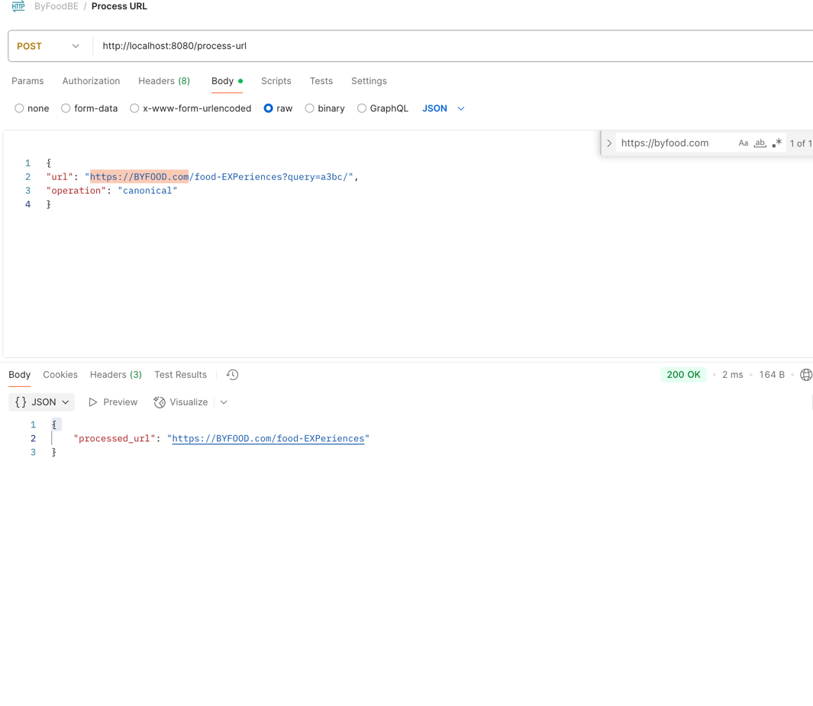
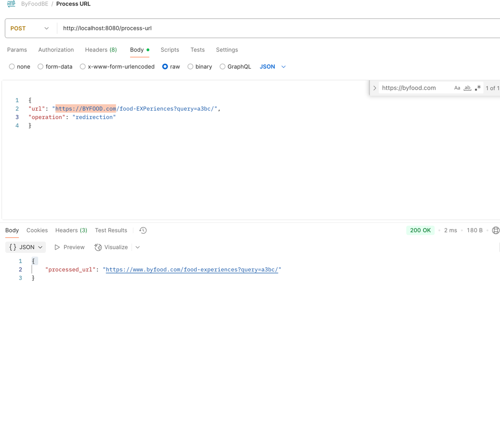
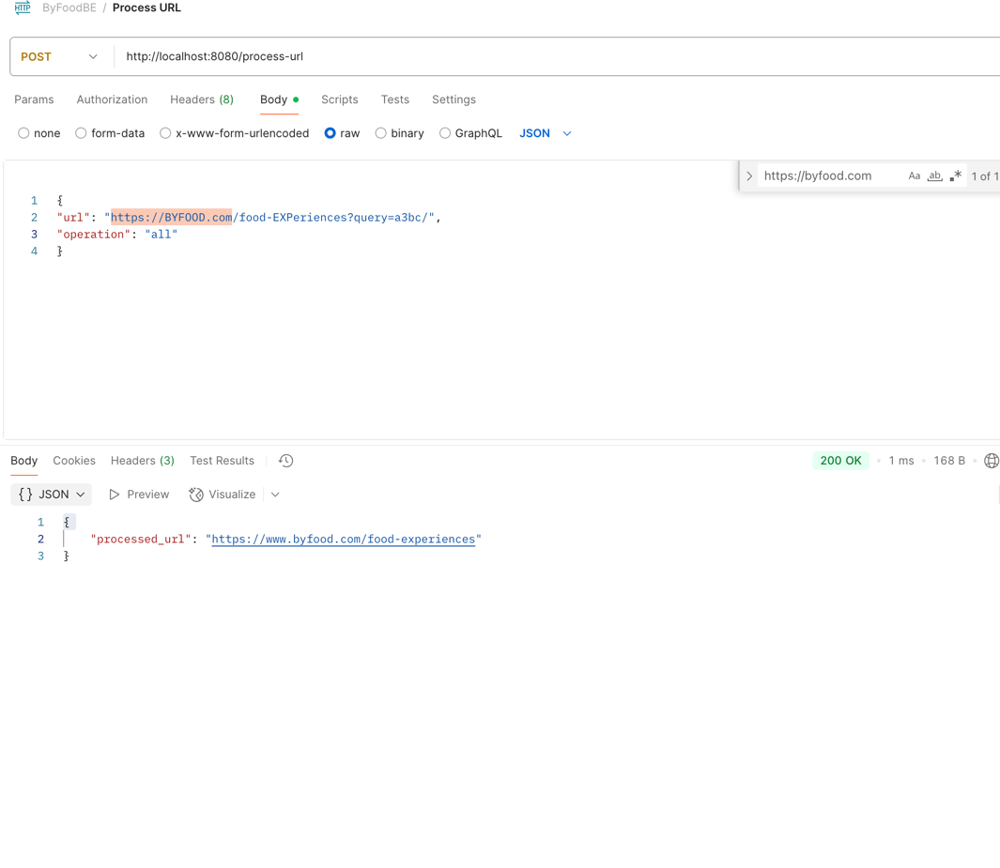

# URL Cleanup and Redirection Service

## Overview
This service provides an HTTP API to process URLs according to specific rules for canonicalization and redirection. It is implemented in Go and exposes a single POST endpoint that accepts a JSON payload and returns a processed URL.

## Features
- **Canonicalization**: Removes query parameters and trailing slashes from URLs.
- **Redirection**: Ensures the domain is `www.byfood.com` and converts the entire URL to lowercase. Only URLs from the `byfood.com` domain are accepted for redirection.
- **Combined Operation**: Applies both canonicalization and redirection.
- **Input Validation**: Handles invalid input and returns clear error messages.

## Project Structure
```
urlrefining/
├── go.mod           # Go module definition
├── main.go          # Main application logic and HTTP server
├── models.go        # (Optional) Data models (not required for basic operation)
```

## Installation
### Prerequisites
- Go 1.18 or newer

### Steps
1. Clone the repository or copy the project files to your local machine.
2. Navigate to the project directory:
   ```sh
   cd /path/to/urlrefining
   ```
3. (Optional) Download dependencies (if any):
   ```sh
   go mod tidy
   ```

## Running the Service
Start the HTTP server with:
```sh
go run main.go
```
The service will be available at `http://localhost:8080`.

## API Usage
### Endpoint
```
POST /process-url
```

### Request Body
JSON object with the following fields:
- `url` (string): The URL to process.
- `operation` (string): One of `canonical`, `redirection`, or `all`.

#### Example
```
{
  "url": "https://BYFOOD.com/food-EXPeriences?query=a3bc/",
  "operation": "redirection"
}
```

### Response
- On success:
  ```
  {
    "processed_url": "https://www.byfood.com/food-experiences?query=a3bc/"
  }
  ```
- On error:
  ```
  {
    "error": "<error message>"
  }
  ```

## Testing
You can test the service using `curl` or any API client (e.g., Postman).
For those with IDE Goland, you can right-click the project and select run with coverage to execute test scenarios.

### Example Test Cases
#### Canonicalization
```
curl -X POST -H "Content-Type: application/json" \
  -d '{"url":"https://byfood.com/food/?ref=abc","operation":"canonical"}' \
  http://localhost:8080/process-url
```

#### Redirection
```
curl -X POST -H "Content-Type: application/json" \
  -d '{"url":"https://BYFOOD.com/food-EXPeriences?query=a3bc/","operation":"redirection"}' \
  http://localhost:8080/process-url
```

#### Both Operations
```
curl -X POST -H "Content-Type: application/json" \
  -d '{"url":"https://byfood.com/food/?ref=abc","operation":"all"}' \
  http://localhost:8080/process-url
```

#### Invalid Domain (Redirection)
```
curl -X POST -H "Content-Type: application/json" \
  -d '{"url":"https://example.com/food","operation":"redirection"}' \
  http://localhost:8080/process-url
```

## Notes
- Only `byfood.com` and `www.byfood.com` domains are accepted for redirection.
- The service returns clear error messages for invalid input or unsupported operations.

## License





